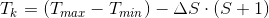
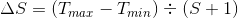

# About

Originally, the complex network approaches in computer vision started in 2009,
when [1] presented a method based on complex networks that computes features for
boundary shape analysis on 2D images. After that, several works on 2D images
textures with complex networks were deployed. The method proposed by [2]
generates graphs from the self-avoiding walks algorithm. In [3], each pixel
from the image is considered as a vertex of the network and the connection
weight is proportional to the distance of the vertices and the difference of
their intensities. In [4], there is presented an application of the
self-avoiding walks graphs approach on dynamic textures for classification,
segmentation and clustering that were better than the state-ofthe-art methods on
dynamic textures. Recently, [5] proposed an application of the complex networks
for 2D images texture recognition that uses the pixel intensity as a third
dimension of the pixel position. In 2012, [6] proposed an application of the
complex networks for 3D objects recognition, but the graphs were extracted from
2D views of the objects. Last year, [7] proposed a complex networks application
for 3D shapes description, achieving promising results.

This repository project was implemented by Carlos André Braile Przewodowski
Filho to make easier the use of the Complex Networks shape descriptor using C++.

* __[1] A. R. Backes, D. Casanova, and O. M. Bruno__,_“A complex network based
approach for boundary shape analysis”_, Pattern Recognition, pp.54–67, 2009._
* __[2] A. R. Backes, A. S. Martinez, and O. M. Bruno__,_“Texture analysis using
graphs generated by deterministic partially self-avoiding walks”_, Pattern
Recognition, pp. 1684–1689, 2011._
* __[3] A. R. Backes, D. Casanova, and O. M. Bruno__, _“Texture analysis and
classification: A complex network-based approach”_, Information Sciences,
pp. 168–180, 2013.
* __[4] W. N. Gonçalves and O. M. Bruno__, _“Dynamic texture analysis and
segmentation using deterministic partially self-Avoiding walks”_, Expert
Systems with Applications, pp. 4283–4300, 2013.
* __[5] J. B. Florindo, G. Landini, and O. M. Bruno__, _“Three-dimensional
connectivity index for texture recognition”_, Pattern Recognition Letters,
pp. 239–244, 2016._
* __[6] J. Tang, B. Jiang, C.-C. Chang, and B. Luo__, _“Graph structure analysis
based on complex network”_, Digital Signal Processing, pp. 713–725,
2012.
* __[7] C. A. B. Przewodowski Filho and F. S. Osório__, _"Complex Network Shape
Descriptor For 3D Objects Classification"_. In: 2017 Latin American Robotics
Symposium (LARS) and 2017 Brazilian Symposium on Robotics (SBR). [S.l.]:
IEEE, 2017. p. 1–5.

# How to Use

## The adjacency matrices

To use the CNSD features, one must convert their data to the class
`AdjacencyMatrix`, included in the file `src/include/adjacency_matrix.cpp`.

The class can load the adjacency matrix from a __file__ or can be computed
during the application runtime.

To load from a __file__, simply instantiate the matrix _m_ and load using
`m.fromFile(<file_name>);`.

To compute it during the application runtime, one need to instantiate it
already with its number of nodes and connection type (`CON_DIRECTED` or
`CON_UNDIRECTED`). After, to set the weights the program must iterate over
each value of the system's value and use `m.setWeight(<node_from>,
<node_to>, <weight>);`. Then your matrix is ready to be used on the CNSD method.

## The descriptor implementation

The CNSD method is in the file `src/include/cnsd.cpp` and it is dependent on
all the other `include` files. The parameters are:

* The __adjacency matrix__ that represents your system;
* The __number of threshold cuts__ used to analyse the evolution of your system;
* The __minimum threshold value__, which can be interpreted as the lowest value
your cuts can assume (example below this list);
* The __maximum threshold value__, which can be interpreted as the highest value
yout cuts can assume (example below this list).

The cutting formula for each step is:

where _Tmin_ and _Tmax_ are the minimum and maximum
thresholds; _Tk_ is the current step threshold; _s_ is the current
step and _(Delta)S_ is the step size. The step size is computed as follows:

For instance, suppose that one wants the threshold to range between [0, 1], with
3 equal cuts. Then, the first cut will be on values bigger than 0.75, the second
will be on values bigger than 0.5 and the third on values bigger than 0.25.

## The included tests

The `src/test/test_am_io.cpp` file runs the basic features of the adjacency
matrices. It is a basic example of how to use the class `AdjacencyMatrix`.

The `src/test/test_cut.cpp` file demonstrates the complex network evolution
over an adjacency matrix.

Finally, the `src/test/test_sd.cpp` is an example of how to compute the shape
descriptor from a handcrafted adjacency matrix.
